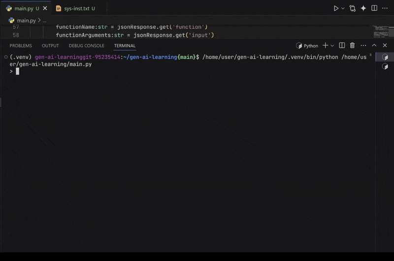

# Beginner's Guide to Running the Code in lv5

This tutorial will guide you through the steps to run the code located in this directory (lv5).



## Files Overview

This directory contains the following files:

*   **main.py:** The primary Python file that executes the main logic.
*   **helper.py:** A helper Python file, possibly containing utility functions or classes used by `main.py`.
*   **sys-inst.txt:** A text file that contains instructions. The `main.py` file reads these instructions.

## Steps to Run the Code

1.  **Ensure you have Python installed:** Verify that Python is installed on your system by opening a terminal or command prompt and typing `python --version`. If Python is not installed, download and install it from [https://www.python.org/downloads/](https://www.python.org/downloads/).

2.  **Navigate to the directory:** Open your terminal or command prompt and use the `cd` command to navigate to the `lv5` directory where the files are located. For example:
```
bash
    cd path/to/lv5
    
```
3.  **Run main.py:** Execute the main Python file by typing the following command in your terminal:
```
bash
    python main.py
    
```
4.  **Observe the output:** The `main.py` file will read the instructions from `sys-inst.txt` and perform some actions. Observe the output in your terminal.

5. **Check run.gif:** Take a look at the run.gif file to see the program being executed.

## That's it!

You have now successfully run the code in the `lv5` directory.